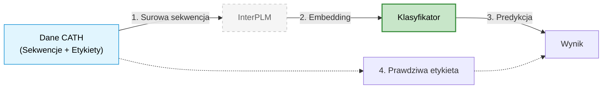

```mermaid
flowchart LR
    %% Węzły
    CATH["Dane CATH<br/>(Sekwencje + Etykiety)"]
    PLM["InterPLM<br/>"]
    CLF["Klasyfikator<br/>"]
    RESULT["Wynik"]

    %% Przepływ
    CATH -- "1. Surowa sekwencja" --> PLM
    PLM -- "2. Embedding" --> CLF
    CLF -- "3. Predykcja" --> RESULT
    CATH -.->ResultLabel["4. Prawdziwa etykieta"] -.-> RESULT

    %% Stylizacja
    classDef data fill:#e1f5fe,stroke:#0288d1,color:black
    classDef frozen fill:#f5f5f5,stroke:#bdbdbd,stroke-dasharray: 5 5,color:#616161
    classDef trainable fill:#c8e6c9,stroke:#388e3c,stroke-width:2px,color:black

    %% Przypisanie klas
    class CATH data
    class PLM frozen
    class CLF trainable
```
