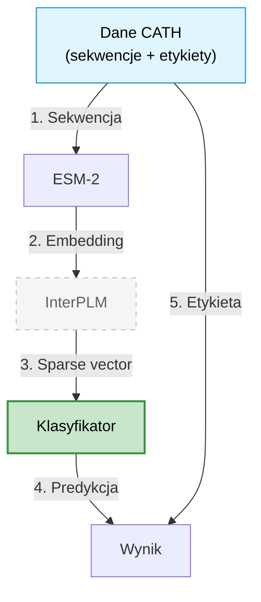
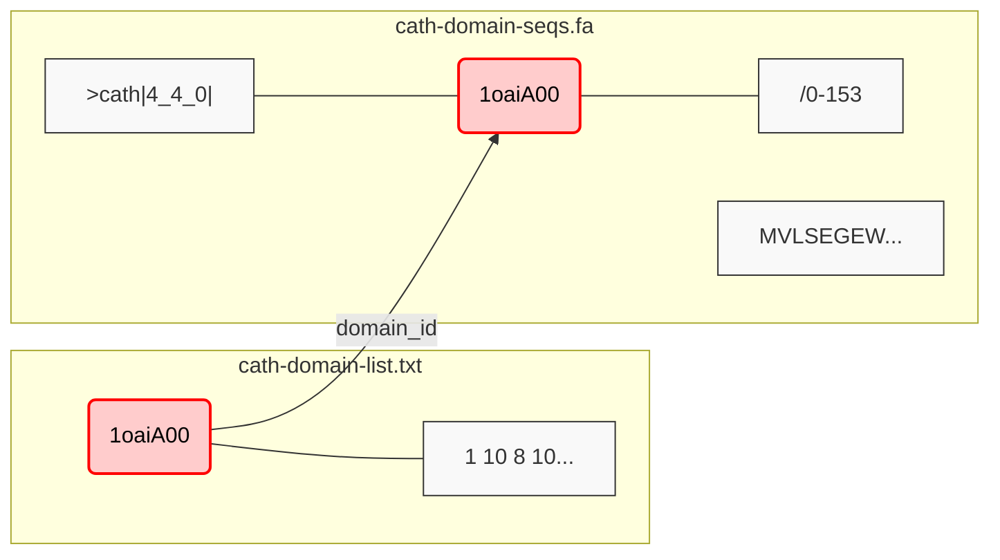
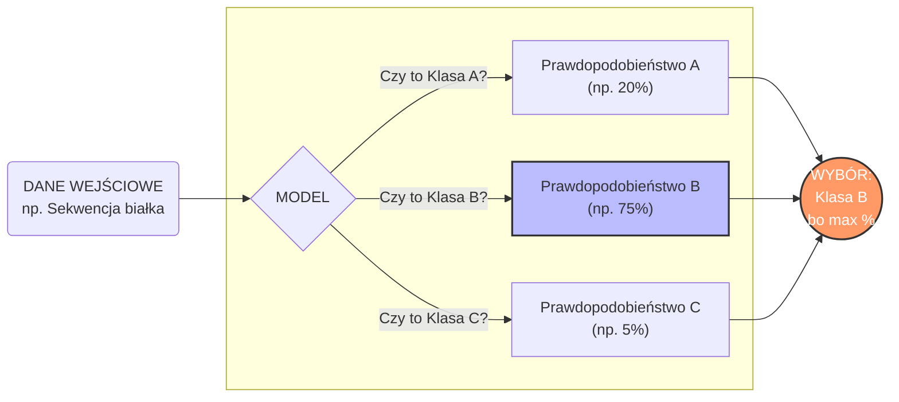

```mermaid
flowchart TD
    %% Węzły
    CATH["Dane CATH<br/>(sekwencje + etykiety)"]
    ESM["ESM-2"]
    PLM["InterPLM<br/>"]
    CLF["Klasyfikator<br/>"]
    RESULT["Wynik"]

    %% Przepływ
    CATH -- "1. Sekwencja" --> ESM
    ESM -- "2. Embedding" --> PLM
    PLM -- "3. Sparse vector" --> CLF
    CLF -- "4. Predykcja" --> RESULT
    CATH -- "5. Etykieta" --> RESULT

    %% Stylizacja
    classDef data fill:#e1f5fe,stroke:#0288d1,color:black
    classDef frozen fill:#f5f5f5,stroke:#bdbdbd,stroke-dasharray: 5 5,color:#616161
    classDef trainable fill:#c8e6c9,stroke:#388e3c,stroke-width:2px,color:black

    %% Przypisanie klas
    class CATH data
    class PLM frozen
    class CLF trainable
```

```mermaid
graph LR
    Input(Sekwencja aminokwasów MVLSEGE...) --> Model[PLM]
    Model --> Output(Embeddingi)

    %% Stylizacja: Ukrywamy ramki dla Input i Output (stroke-width:0px)
    style Input fill:#fff,stroke-width:0px,color:#000
    style Output fill:#fff,stroke-width:0px,color:#000

    %% Stylizacja: Wyróżniamy PLM
    style Model fill:#f9f,stroke:#333,stroke-width:2px
```

```mermaid
graph LR
    Input(Aktywacja z warstwy 1-6 modelu PLM) --> Model[InterPLM]
    Model --> Output(Rzadki wektor aktywacji)

    %% Stylizacja: Ukrywamy ramki dla Input i Output (stroke-width:0px)
    style Input fill:#fff,stroke-width:0px,color:#000
    style Output fill:#fff,stroke-width:0px,color:#000

    %% Stylizacja: Wyróżniamy PLM
    style Model fill:#f9f,stroke:#333,stroke-width:2px
```

```mermaid
graph LR
    %% Definicje stylów
    classDef file fill:#f9f9f9,stroke:#333,stroke-width:1px;
    classDef idNode fill:#ffcccc,stroke:#ff0000,stroke-width:2px,color:black;

    %% POPRAWKA: Dodano cudzysłów " " wewnątrz nawiasów kwadratowych
    subgraph Classification ["cath-domain-list.txt"]
        direction LR
        ID1(1oaiA00):::idNode --- Data1["1  10  8  10..."]:::file
    end

    %% POPRAWKA: Tutaj również dodano cudzysłów dla bezpieczeństwa
    subgraph Sequence ["cath-domain-seqs.fa"]
        direction TB
        HeaderBox[">cath|4_4_0|"]:::file --- ID2(1oaiA00):::idNode --- Suffix["/0-153"]:::file
        SeqBody["MVLSEGEW..."]:::file
    end

    %% Połączenie
    ID1 -->|domain_id| ID2                                                                                                                                                                                              
```

```mermaid
graph LR
    Input(DANE WEJŚCIOWE<br>np. Sekwencja białka) --> Model{MODEL}
    
    subgraph " "
    Model -- "Czy to Klasa A?" --> ScoreA["Prawdopodobieństwo A<br>(np. 20%)"]
    Model -- "Czy to Klasa B?" --> ScoreB["Prawdopodobieństwo B<br>(np. 75%)"]
    Model -- "Czy to Klasa C?" --> ScoreC["Prawdopodobieństwo C<br>(np. 5%)"]
    end

    ScoreA --> Decyzja((WYBÓR:<br>Klasa B<br>bo max %))
    ScoreB --> Decyzja
    ScoreC --> Decyzja

    style Decyzja fill:#f96,stroke:#333,stroke-width:2px,color:white
    style ScoreB fill:#bbf,stroke:#333,stroke-width:2px
```